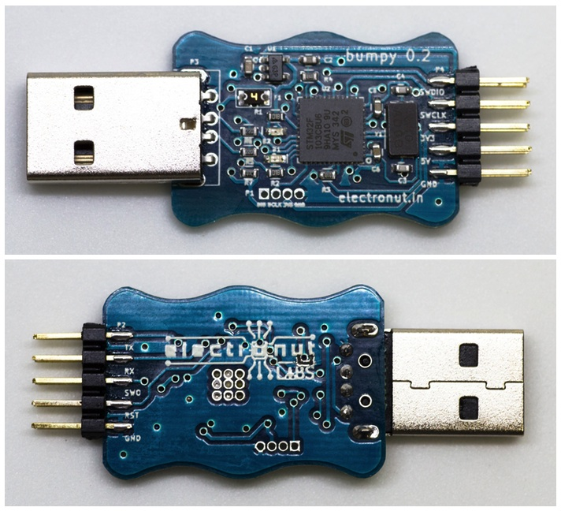
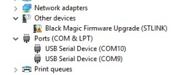
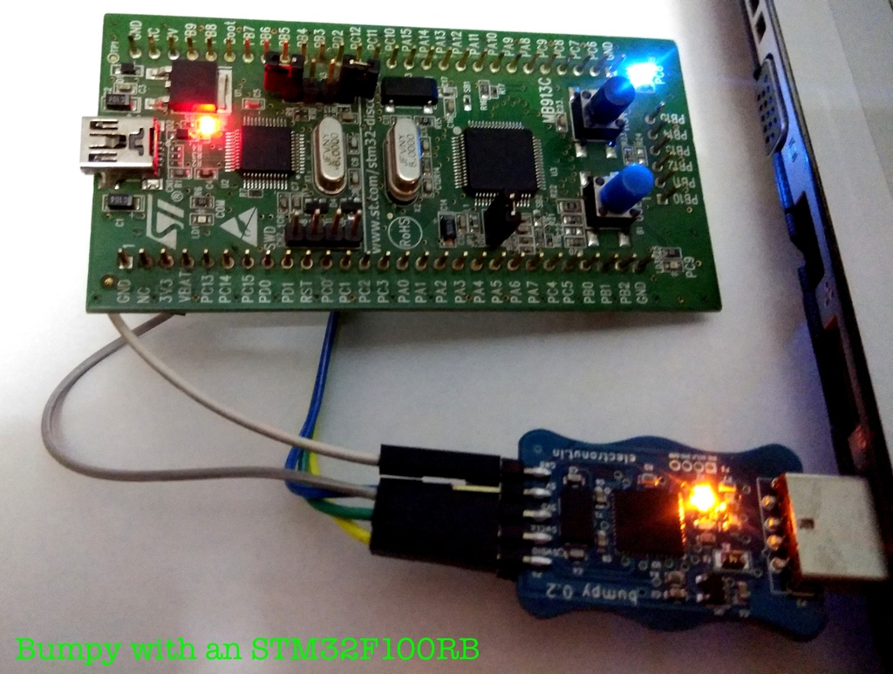

## What is Bumpy?

**Bumpy** is an inexpensive Open Source **blackmagic probe** compatible SWD debugger designed to
be used with ARM GDB. It supports [many platforms][3], but was primarily designed
for use with our Nordic Semiconductor nRF BLE boards.

When we built our [Bluey][1] nRF52 BLE dev board, we were looking for an inexpensive
option for our users to upload code to bluey and debug it using ARM GDB. We then came
across the [blackmagic probe][2] (BMP) project - an Open Source debugging tool for
embedded microprocessors. It greatly simplifies the debugging and code
uploading process using just ARM GDB - no need to run a GDB server or use an
additional complex tool like **openocd**. Although the BMP hardware is excellent,
it's bit beyond the budget of our target audience as an add-on programmer.
So we decided to make use of their liberal open source license and build something
that fits our budget, albeit with less capabilities.

**Bumpy** takes advantage of the **ST-Link** support of the BMP, and its design
is based on both BMP and Chinese **St-Link V2** clones available for cheap in the market.

## Plugging in Bumpy

When you plug in Bumpy, you'll see two ports - one for blackmagic probe functionality
and the other for a UART you can use for printing debug messages without plugging
in a separate USB to serial adapter.

This is how it looks on *OS X*. (Linux should be similar.):

```
$ ls /dev/tty.usb**
/dev/tty.usbmodemD5C57BD1	/dev/tty.usbmodemD5C57BD3
```

This is how it looks on the Windows Device Manager:



## Bumpy Firmware

Bumpy already comes with the blackmagic probe firmware. In case you need to build it, here's what you do:

```
git clone https://github.com/electronut/blackmagic.git
cd blackmagic
git submodule init
git submodule update
cd libopencm3/
make lib
cd ../src/
$ make PROBE_HOST=stlink
```

After the above, follow the [procedure in our docs][9] to upload the firmware to the STM32 chip.

## Updating Bumpy Firmware

The latest binaries are included in the [firmware](firmware) directory of this repository.

In order to update the blackmagic probe firmware on Bumpy, you need to have [dfu-util](http://dfu-util.sourceforge.net/) installed in your system.

### Windows

* Download and extract the contents of **dfu-util-0.9-win64.zip** file.

* Add the location of **dfu-util.exe** executable, available in the extracted folder from above, to your
path variables.

* Ensure that dfu-util is part of your PATH variables by simply running a command prompt and typing **dfu-util**.

* Plug-in Bumpy. Wait until the onboard red LED turns on.

* In Windows, you need WinUSB or libusb drivers for dfu-util to work. These drivers can be installed using [Zadig](http://zadig.akeo.ie/).

* Run: **Zadig**.

* Select: **Black Magic Firmware Upgrade (STLINK) (Interface 4)** from the drop down menu.

* If no device is available for selection, go to: Options > List All Devices.

* Select **WinUSB** driver and click on **Install**.

* The above steps have enabled firmware update functionality over USB.

* Now, check that you are in the same directory as the **bumpy-rev1.1.bin**

* Run: `dfu-util -d 1d50:6018,:6017 -s 0x08002000:leave -D bumpy-rev1.1.bin`.

* Wait for firmware to load. The expected output is shown below:


* Remove Bumpy and plugin again, to reset the chip.

The firmware has been updated successfully.


## Using Bumpy

Here are a few example of using Bumpy.

Jump To:

- [Using Bumpy with Bluey (Nordic nRF52832)](#bluey)
- [Using Bumpy with an STM32F100RB](#stm32f100)

<hr />

## <a name="bluey"></a> Using Bumpy with Bluey (Nordic nRF52832)

Here, we assume that you have files *blinky.hex* and *blinky.out* in the working
directory where you start GDB. (You can generate these files yourself using the
  *peripheral/blinky/pca10040/blank* example in the Nordic SDK.)

Connect the debugger to bluey as follows:

| Bumpy | bluey |
|----------|-------|
| 3.3 | VDD|
| GND | GND|
| SWCLK | SWCLK|
| SWDIO | SWDIO|

Here's what the hookup looks like:


Now, open a command shell and run **arm-none-eabi-gdb**:

```
C:\Users\mahesh>arm-none-eabi-gdb
GNU gdb (GNU Tools for ARM Embedded Processors 6-2017-q1-update) 7.12.1.20170215-git
Copyright (C) 2017 Free Software Foundation, Inc.
License GPLv3+: GNU GPL version 3 or later <http://gnu.org/licenses/gpl.html>
This is free software: you are free to change and redistribute it.
There is NO WARRANTY, to the extent permitted by law.  Type "show copying"
and "show warranty" for details.
This GDB was configured as "--host=i686-w64-mingw32 --target=arm-none-eabi".
Type "show configuration" for configuration details.
For bug reporting instructions, please see:
<http://www.gnu.org/software/gdb/bugs/>.
Find the GDB manual and other documentation resources online at:
<http://www.gnu.org/software/gdb/documentation/>.
For help, type "help".
Type "apropos word" to search for commands related to "word".
(gdb)
```

Now you need to connect to the target. The Black Magic Probe hardware will
create two COM ports, and you need to connect to the first one for debugging.
(You can see the ports in the *Device Manager*.)


```
(gdb) target extended-remote COM5
Remote debugging using COM5
```

**Note**

On Windows, for ports >= `COM10`, add the prefix `\\.\`.

For example:

```
(gdb) target extended-remote COM3
(gdb) target extended-remote \\.\COM10
```

Now, we scan for targets. We're using SWD here.

```
(gdb) monitor swdp_scan
Target voltage: unknown
Available Targets:
No. Att Driver
 1      Nordic nRF52
```

You can see above that it found our nRF52 target - the chip in Bluey. Now
let's connect to it.

```
(gdb) attach 1
Attaching to Remote target
warning: No executable has been specified and target does not support
determining executable automatically.  Try using the "file" command.
0x0002099e in ?? ()
(gdb)
```

Now let's upload some code to the flash memory.

```
(gdb) file blinky.hex
Reading symbols from blinky.hex...(no debugging symbols found)...done.
```

Now let's run the program.

```
(gdb) run
Starting program: C:\mahesh\nRF5_SDK_12.2.0_f012efa\examples\peripheral\blinky\pca10040\blank\armgcc\_build\blinky.hex
```
At this point you'll be able to see the LED blinking on **bluey** in various colors.

Now we're ready to do some debugging. We'll use the *.out* file this time, since that has
the necessary code symbols required for debugging.

```
(gdb) file blinky.out
A program is being debugged already.
Are you sure you want to change the file? (y or n) y
Reading symbols from blinky.out...done.
(gdb) run
The program being debugged has been started already.
Start it from the beginning? (y or n) y
Starting program: C:\mahesh\nRF5_SDK_12.2.0_f012efa\examples\peripheral\blinky\pca10040\blank\armgcc\_build\blinky.out
```

Now press Ctrl-C.

```
Program received signal SIGINT, Interrupt.
0x00001990 in nrf_delay_us (number_of_us=500000) at ../../../../../../components/drivers_nrf/delay/nrf_delay.h:128
128     __ASM volatile (
(gdb) list
123     __STATIC_INLINE void nrf_delay_us(uint32_t number_of_us)
124     {
125         const uint32_t clock16MHz = CLOCK_FREQ_16MHz;
126         if (number_of_us)
127         {
128     __ASM volatile (
129     #if ( defined(__GNUC__) && (__CORTEX_M == (0x00U) ) )
130             ".syntax unified\n"
131     #endif
132     "1:\n"
(gdb)
```

As you can see, it's showing you the code being executed. Now let's put a breakpoint in
*main.c*:

```
(gdb) break main.c:43
Breakpoint 4 at 0x1a04: file ../../../main.c, line 43.
(gdb) run
The program being debugged has been started already.
Start it from the beginning? (y or n) y
Starting program: C:\mahesh\nRF5_SDK_12.2.0_f012efa\examples\peripheral\blinky\pca10040\blank\armgcc\_build\blinky.out

Breakpoint 4, main () at ../../../main.c:43
43                  nrf_delay_ms(500);
(gdb) list
38          while (true)
39          {
40              for (int i = 0; i < LEDS_NUMBER; i++)
41              {
42                  bsp_board_led_invert(i);
43                  nrf_delay_ms(500);
44              }
45          }
46      }
47
(gdb) p i
$2 = 0
(gdb) continue
Continuing.

Breakpoint 4, main () at ../../../main.c:43
43                  nrf_delay_ms(500);
(gdb) p i
$3 = 1
(gdb)
```

As you can see above, as we loop through, we can see *i* changing. Cool huh?

If you want to learn how to use GDB I highly recommend [Art of debugging][6] by
Norman Matloff and Peter Jay Salzman.

### Loading code with Softdevice

In the above example, we used the *blinky* code which did not have a Softdevice.
Since most of our use of this chip will use BLE and hence a Nordic Softdevice, let's
take the SDK example *ble_app_hrs* and see how to load it.

First, build *ble_app_hrs* to generate the program hex file. Then use the
Nordic *mergehex* tool to combine the softdevice and program as given below.
The softdevice cam be found in *components/softdevice* folder of the SDK.

```
c:\mahesh\tmp>mergehex -m s132_nrf52_3.0.0_softdevice.hex nrf52832_xxaa.hex -o out.hex
Parsing input hex files.
Merging files.
Storing merged file.

c:\mahesh\tmp>ls -l
total 467
-rw-r--r--    1 info     Administ   130859 May  8 08:33 nrf52832_xxaa.hex
-rw-r--r--    1 info     Administ   476926 May  8 08:35 out.hex
-rw-r--r--    1 info     Administ   346118 Jul 25  2016 s132_nrf52_3.0.0_softdevice.hex
```

Now load it using our Black Magic Probe clone as shown before.

```
(gdb) load out.hex
Loading section .sec1, size 0x964 lma 0x0
Loading section .sec2, size 0xf000 lma 0x1000
Loading section .sec3, size 0xe740 lma 0x10000
Loading section .sec4, size 0x1000 lma 0x1f000
Loading section .sec5, size 0xa5a4 lma 0x20000
Start address 0x0, load size 169544
Transfer rate: 17 KB/sec, 968 bytes/write.
(gdb) run
```

And now you'll see the HRS app running happily on **bluey**!

**Note**

`monitor erase_mass` can be used to erase the flash memory. It works for nRF52
but I am not sure if that's the case for all supported targets.

## Using the UART via USB on Bumpy

Bumpy supports UART, so you can use it for debugging your board without using up
another USB

Connect the debugger to bluey as follows:

| Bumpy | bluey |
|----------|-------|
| 3.3 | VDD|
| GND | GND|
| SWCLK | SWCLK|
| SWDIO | SWDIO|
| Rx | P0.TX|
| Tx | P0.RX|

*P0.TX* and *Po.RX* can be any pins - just configure them for UART in your program.

You UART setup should look something like this:

```
static void uart_init(void)
{
    uint32_t                     err_code;
    const app_uart_comm_params_t comm_params =
    {
        RX_PIN_NUMBER, // use P0.RX
        TX_PIN_NUMBER, // use P0.TX
        RTS_PIN_NUMBER,
        CTS_PIN_NUMBER,
        APP_UART_FLOW_CONTROL_DISABLED,
        false,
        UART_BAUDRATE_BAUDRATE_Baud115200
    };

    APP_UART_FIFO_INIT( &comm_params,
                       UART_RX_BUF_SIZE,
                       UART_TX_BUF_SIZE,
                       uart_event_handle,
                       APP_IRQ_PRIORITY_LOWEST,
                       err_code);
    APP_ERROR_CHECK(err_code);

    // UART enabled
    uart_enabled = true;
}
```

## <a name="stm32f100"></a> Using Bumpy with an STM32F100RB



Click [here][8] to read about using Bumpy with an STM32F100RB chip. This examples compiles a minimal blink code for **STM32VLDiscovery** using **unicore-mx**.

## Using GDB in the Atom editor

[Atom][4] is gaining popularity an easy to use modern code editor. It has support for a
bewildering range of plugins, and so it has one for GDB as well - the [atom-gdb-debugger package][5].

Follow the instructions for installing the above plugin, and ensure that *arm-eabi-none-gdb* is in your PATH.

Search for "GDB Debugger" in the Atom help menu, and you'll find what you need.

The plugin is quite bare-bones and doesn't offer much more than what you get from a
command shell. But I suppose it's nice to be able to see the code and step through it from
within Atom.

## Buy a Bumpy!

Bumpy is available for purchase from our [Tindie store][7]. We also provide discounts for bulk purchases. Do email us at **info@electronut.in** if you have any questions.

<a href="https://www.tindie.com/stores/ElectronutLabs/?ref=offsite_badges&utm_source=sellers_ElectronutLabs&utm_medium=badges&utm_campaign=badge_large"></a>

[1]: http://electronut.in/bluey/
[2]: https://github.com/blacksphere/blackmagic
[3]: https://github.com/blacksphere/blackmagic/wiki
[4]: https://atom.io/
[5]: https://atom.io/packages/atom-gdb-debugger
[6]: https://www.nostarch.com/debugging.htm
[7]: https://www.tindie.com/stores/ElectronutLabs/
[8]: https://github.com/ntavish/unicoremx-template
[9]: https://github.com/electronut/ElectronutLabs-bluey/blob/master/blackmagic-prog.md
